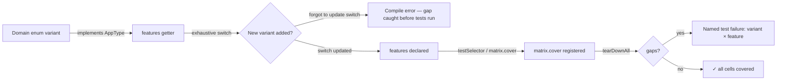
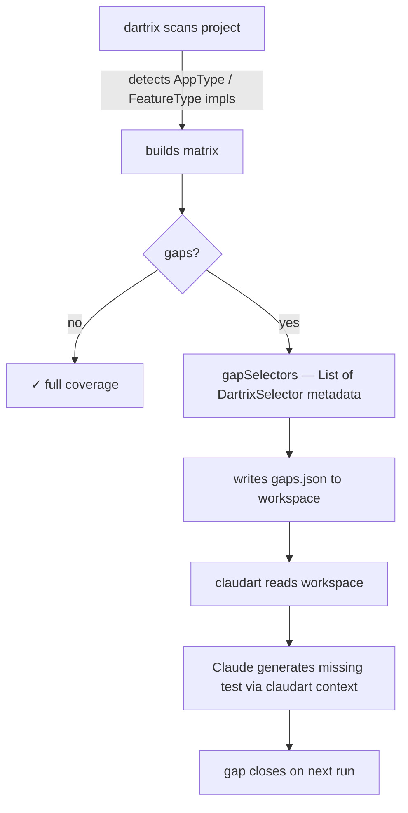

# dartrix — plan

This file is the never-lose-context document for dartrix.
README.md = current API. CHANGELOG.md = version history. PLAN.md = vision + reasoning + where we are.

---

## Vision

dartrix is a test matrix framework for Dart apps built on enhanced enums.
The core insight: your domain enums already know which features they participate in.
dartrix makes that knowledge structural — a compile-time exhaustive switch becomes
the coverage contract, and the framework surfaces gaps as named failures rather than
silent omissions.

The long-term goal: a family of adapters (`DartrixCubit`, `DartrixBloc`,
`DartrixRiverpod`, `DartrixIsolate`) that plug into any Dart/Flutter state management
pattern. Each adapter registers coverage as a side effect of state transitions — not a
manual chore in test bodies.

---

## How this file is maintained

This PLAN.md is the prototype reference implementation for what `claudart add` will generate
automatically for dartrix-using projects. The sections below (Vision, Design principles, What's
been built, What's next, Key decisions log) are the canonical template shape.

Diagrams live inline — next to the feature they describe. When a feature moves from "what's
next" to "what's built", the diagram moves with it. README.md is a curated view of this
file — it never originates content that isn't here first.

---

## Design principles

**Proven before promoted.**
Every dartrix API is validated in a real consumer app (zedup) before landing in the
framework. This means we never abstract speculatively. The API earns its existence
from real usage.

**Compile-time over runtime.**
Exhaustive switches in `AppType.features` catch gaps before tests run. Adding a new
enum variant without declaring its feature participation is a compile error.

**Selectors over manual registration.**
`DartrixSelector` + `testSelector()` replace scattered `matrix.cover()` calls.
Coverage is structural — a consequence of using the selector, not a chore to remember.

**No magic.**
No code generation, no reflection, no annotations. Just interfaces, switches, a map,
and one function that wraps `test()`.

---

## Relationship to zedup

zedup is dartrix's proving ground. The flow:

```
design in conversation
        ↓
implement in zedup (concrete, real tests)
        ↓
confirm it works end-to-end
        ↓
promote to dartrix (abstract interface + function)
        ↓
zedup bumps dartrix dep and removes its local impl
```

This means zedup will sometimes carry temporary local implementations that are
"ahead" of dartrix. That's intentional — zedup confirms the API before dartrix
commits to it.

---

## What's been built

### v0.1.0 — Core matrix
- `Dartrix` class — `axes`, `features`, `cover()`, `gaps()`, `stateOf()`
- `CellState` — `covered` / `gap` / `notApplicable`
- `MatrixCell` — `({AppType variant, FeatureType feature})` typedef
- `MatrixRenderer` — `render()` table + `renderGaps()` failure output
- Type hierarchy: `AppType`, `FeatureType`, `ComponentType`, `HelperType`, `ClassType`

**Why AppType.features uses an exhaustive switch:**
The switch is the enforcement mechanism. Dart's exhaustiveness checker makes it a
compile error to add a new enum variant without declaring its feature participation.
This is the compile-time coverage detector — no runtime check can do this.

### v0.1.1 — Rename
- `DartrixMatrix` → `Dartrix`

**Why:** The package name is the class name. `Matrix` suffix was redundant noise.

### Coverage flow — how dartrix enforces completeness



### v0.1.2 — Selectors
- `DartrixSelector` interface — `variant`, `feature`, `description`
- `testSelector<S>()` — wraps `test()`, registers `cover()` automatically, generic `S`
  preserves concrete selector type
- `TypedSelector<V>` — concrete selector where `variant` is typed as `V`, not `AppType`
- `AppTypeGetSelector.getSelector(feature)` — extension on every `AppType` variant;
  returns `TypedSelector<V>`. Zero boilerplate — the enum IS the selector factory.

**Why the generic S matters:**
Without `S`, test bodies need to cast `sel as ConcreteSelector` to access app-specific
input getters. With `S extends DartrixSelector`, the concrete type flows through.
No cast, no runtime risk.

**Why coverage after body, not before:**
If `cover()` ran before the body, a test could register coverage and then fail its
assertions — the matrix would show covered but the test would be broken. Running
`cover()` after the body ensures coverage only registers when the test actually passes.

**TypedSelector<V> proved then superseded explicit subclasses:**
zedup built 8 concrete `DartrixSelector` subclasses (`BranchStatusSelector` etc.)
to prove the pattern. Once `TypedSelector<V>` was validated, all 8 were retired —
`sel.variant` is already typed, no subclass needed. See zedup `retired/selectors_retired.md`.

### Framework self-validation (fix/matrix-test-coverage)
- `test/stubs.dart` — shared `TestType`/`TestFeature` fixtures; exhaustive switch
  means adding a variant without updating the switch is a compile error
- `test/matrix/matrix_test.dart` — `Dartrix` and `MatrixRenderer` now have their
  own test coverage; `stateOf()`, `gaps()`, accessors, and all render symbols tested
- `test/selector/selector_test.dart` — wired to a live `Dartrix` instance;
  `testSelector()` now verified to register coverage and close gaps; `tearDownAll`
  enforces zero gaps after all loops complete
- Loop discipline enforced: per-value `test()` registrations, not inline loops

---

## What's next

### Immediate — zedup selector migration (async blocker)
zedup's nocterm tests are `async`. `testSelector()` accepts `void Function(S)` — sync
only. Until dartrix adds async support (`FutureOr<void> Function(S)`), zedup's dashboard
and branch screen tests use explicit `matrix.cover()` inside async bodies as a workaround.

Once async `testSelector()` lands, zedup can migrate all `matrix.cover()` loops to
`testSelector()` calls and the branch screen tests gain matrix wiring.

See zedup's PLAN.md for the full selector migration plan.

### Near-term — framework conveniences
- `coverAll(variants, feature)` — bulk coverage for tests that legitimately cover all
  variants at once (invariant checks, snapshot tests). Not a replacement for
  `testSelector` — a complement for a different test shape.
- `testSelectorGroup()` — wraps a list of homogeneous selectors, reduces for-loop
  boilerplate at call sites.

### Adapter templates — proven in zedup first
Each adapter proves the pattern in zedup before landing in dartrix:

1. **`DartrixCubit`** — zedup builds its Cubit layer first. The adapter intercepts
   `emit()` and registers coverage against the emitted state's variant. Zedup confirms
   the API, then dartrix gets it.

2. **`DartrixBloc`** — same pattern, Bloc events instead of Cubit state.

3. **`DartrixRiverpod`** — provider/notifier interception. Zedup doesn't use Riverpod
   today, but the pattern will be proven in another consumer app before shipping.

4. **`DartrixIsolate`** — zedup's refresh feature runs in an Isolate. Coverage cells
   need to cross the isolate boundary. This is the hardest adapter — blocked on zedup's
   refresh implementation.

### Validator mode — final form

dartrix's end state is a **non-invasive validator** that runs alongside any existing
Dart/Flutter project without requiring the author to adopt any new test paradigm.



**What dartrix owns in this mode:**
- Gap detection (`matrix.gaps()`)
- Gap metadata (`gapSelectors()` — returns `List<DartrixSelector>` for every uncovered cell)
- Gap report (`gaps.json` written to claudart workspace — never to the project)

**What claudart owns:**
- Reading the gap report from workspace
- Enriching with project context (PLAN.md, skills.md)
- Passing structured metadata to Claude for test generation
- CLAUDE.md is the binding — Claude in this workspace speaks through claudart

**What the project owns:**
- Its existing tests — untouched
- Its enum mappings (`AppType`, `FeatureType` impls) — opt-in declarations
- Nothing else changes

The gap report is dartrix-typed — no bare strings. dartrix-native types use
`DartrixXxx.value` format. Project-mapped types use their Dart class name:

```json
{
  "dartrixVersion": "0.1.2",
  "project": "zedup",
  "gaps": [
    {
      "variant": { "dartrixType": "AppType",     "ref": "WorkStatus.blocked" },
      "feature":  { "dartrixType": "FeatureType", "ref": "ZedFeature.dashboard" },
      "methodType": "DartrixMethod.helper",
      "cellState": "DartrixCellState.gap",
      "participationDeclared": true,
      "description": "blocked branch visible in dashboard"
    }
  ]
}
```

`participationDeclared: true` — variant's `features` switch includes this feature,
so a test is required, not optional. claudart treats required gaps as bugs, optional
gaps as suggestions.

### DartrixMethod — method classification axis

Methods are a first-class concern. A class isn't just a type — its methods have
semantic categories that determine what a complete test looks like:

```dart
enum DartrixMethod implements FeatureType {
  factory('object construction — was this type instantiated?'),
  fetch('async/network — success and failure paths both required'),
  helper('pure transform — deterministic input/output'),
  override('dart contract — == toString hashCode');

  const DartrixMethod(this.description);
  @override final String description;
}
```

Projects map their class methods to `DartrixMethod` via `ClassType.methods` —
same exhaustive switch pattern as `AppType.features`. Adding a method without
declaring its type = compile error.

`fetch` is special: dartrix knows async methods require two cells — success path
AND failure path. One test covering only the happy path is still a gap.

**Prove in claudart first** (per prove-before-promote):
claudart has `TeardownCategory` (8 variants × 3 getters) and `HandoffStatus`
(5 variants × 1 getter). These are value-correctness matrices — different from
participation coverage. Migrating claudart's matrices to dartrix proves:
- Fixture extension pattern as a formal dartrix template
- Dense coverage (`coverAll()`) for when all variants participate in all features
- `DartrixMethod` classification on real methods before dartrix commits to the API

**claudart's core workflow (handoff, skills, suggest/debug/teardown) is never
touched by this migration.** Only the test matrix for claudart's own enums moves
to dartrix. The workflow is claudart's identity — it stays.

### When pub.dev
After:
- All core APIs stable (matrix, selector, testSelector)
- At least `DartrixCubit` proven and shipped
- `dart pub publish --dry-run` at 0 warnings
- Version at 1.0.0

---

## Key decisions log

| Decision | Why |
|----------|-----|
| `Dartrix` not `DartrixMatrix` | Package name is the class name |
| `test` in `dependencies` not `dev_dependencies` | Consumers need `testSelector()` transitively |
| `AppType.features` returns `Set<FeatureType>` not `List` | Set semantics — participation, not ordering |
| `name` removed from marker interfaces | Dart analyzer doesn't recognize `Enum.name` as satisfying an abstract interface `name` declaration — use `(this as Enum).name` in dartrix internals |
| Selector carries `description` not `name` | `description` is derived from fixture, `name` is the Dart enum identity — distinct concerns |
| Coverage registered after body | Prevents broken tests from appearing covered |
| zedup as proving ground before dartrix gets the API | Speculative APIs get wrong — real usage proves the right shape |
