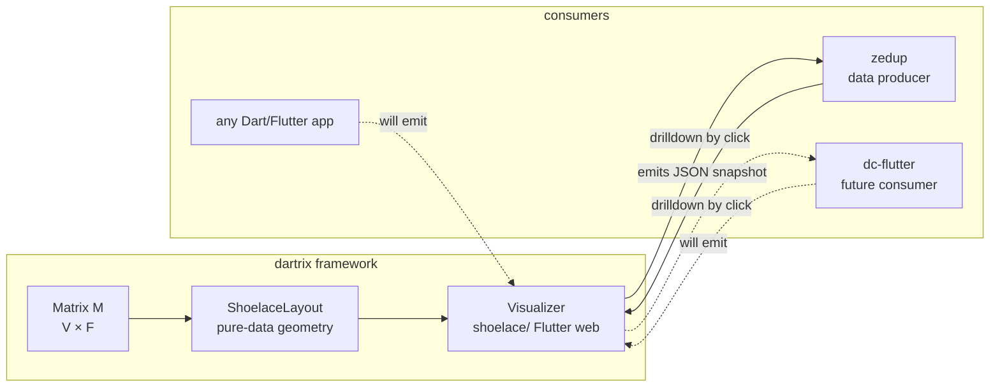
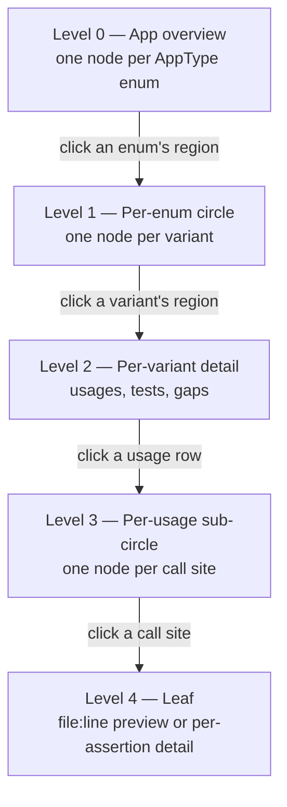
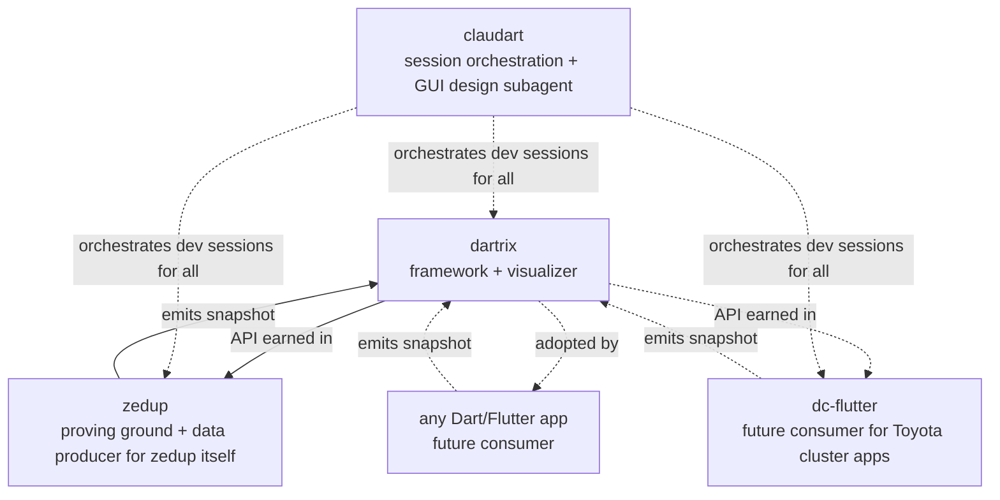

# dartrix — plan

The master roadmap for dartrix. Authoritative. README.md is a curated view of this file. CHANGELOG.md is the version-stamped log of what's shipped.

> **Reading order each session:** PLAN.md (this file, vision + reasoning + where we are) → README.md (current public API) → CHANGELOG.md (version history). When PLAN and README disagree on what's next, PLAN wins. When CHANGELOG and README disagree on what exists, CHANGELOG wins.

---

## Vision

dartrix is the test matrix framework for Dart projects. Three problems it solves, three answers it provides.

**Problem 1 — the silent gap.**
You add `Status.suspended` to a domain enum and ship. The dashboard renders nothing for it. No test failed. No build broke. You find out at 2am.

**Problem 2 — ad-hoc coverage.**
Line coverage tools count statements executed. They don't know your `Status` enum exists or that the `dashboard` feature should render every status. A 99% line-covered module can have a wide-open variant gap.

**Problem 3 — drilldown blindness.**
You have a gap. Where does the missing test belong? Which class? Which method? Which `group()`? Today: grep and guess.

**Answer 1 — compile-time enforcement.**
Every `AppType` variant declares its feature participation in an exhaustive `switch`. Adding a variant without updating the switch is a compile error, not a runtime gap.

**Answer 2 — structural cells.**
The matrix is a binary relation `M ⊆ V × F`. Each cell `(v, f)` has a state: covered, gap, or notApplicable. Gaps are named, listed, and surfaced — not buried in a percentage.

**Answer 3 — fractal visualization.**
The shoelace web app under `shoelace/` renders the matrix as a disc. Each variant is a region. Each region is colored by its variant and shaded by its coverage. Click a region for the per-variant detail. Click a usage to drill into a sub-circle. Same primitive at every level.


```mermaid
graph LR
  subgraph framework[dartrix framework]
    M[Matrix M<br/>V × F]
    S[ShoelaceLayout<br/>pure-data geometry]
    V[Visualizer<br/>shoelace/ Flutter web]
    M --> S
    S --> V
  end
  subgraph consumers[consumers]
    Z[zedup<br/>data producer]
    DC[dc-flutter<br/>future consumer]
    A[any Dart/Flutter app]
  end
  Z -->|emits JSON snapshot| V
  DC -.->|will emit| V
  A -.->|will emit| V
  V -->|drilldown by click| Z
  V -.->|drilldown by click| DC
```

---

## The mathematics

dartrix's coverage model is a binary relation on a domain × codomain matrix.

### The matrix M

Let `V` be the set of variants across all `AppType` enums in a project, and `F` the set of `FeatureType` variants.

```
M ⊆ V × F
```

The matrix is the cross-product. Every `(v, f)` pair is a cell. The cell function `C` assigns a state.

### The cell function C

```
C: V × F → { covered, gap, notApplicable }

C(v, f) = notApplicable   if f ∉ v.features          (variant doesn't declare this feature)
C(v, f) = covered         if matrix.cover(v, f) ran  (a passing test registered the cell)
C(v, f) = gap             otherwise                  (variant declares the feature, no test)
```

The `notApplicable` state is structural — declared by `AppType.features`. The `covered` state is registered by `testSelector()` (or manual `matrix.cover()`). The `gap` state is the absence of either.

### Coverage ratio R

Per variant:

```
R(v) = |{ f ∈ v.features : C(v,f) = covered }| / |v.features|

R(v) = 1.0 if v.features = ∅                         (vacuously fully covered)
R(v) ∈ [0, 1] otherwise
```

The shoelace visualizer reads `R(v)` from each variant entry in the snapshot and uses it to shade that variant's region.

### Snapshot-level average

```
R_avg = (1/|V|) · Σ R(v)
```

Rendered as the COVERAGE bar at the bottom of the shoelace web app.

### Disc geometry

The shoelace visualizer places `N` variants on a circle at angles `θᵢ = 2πi/N`, evenly spaced.

The lace path visits vertices in `[0, N-1, 1, N-2, 2, N-3, ...]` order, producing `N - 1` chords.

Each variant owns a region:

- **Interior** (lace-path positions `1..N-2`): apex-triangle bounded by the apex vertex, the two chords meeting at the apex, and the arc on the far side of the disc.
- **Endpoint** (lace-path positions `0` and `N-1`): rim lune bounded by the apex vertex, the one chord, and the short rim arc to the chord's other endpoint.

Together they tile the disc exactly. No overlaps, no gaps in coverage of the disc itself.

```
Region color    = variant.color  (declared by the consumer, not the matrix)
Region opacity  = α_min + (α_max - α_min) · R(v)
```

For `α_min = 0.30`, `α_max = 0.70`: an uncovered region is dim but visible (color identity preserved); a fully covered region is bright but still translucent (the disc gradient bleeds through). Constants live in `shoelace/lib/src/ui/tokens.dart` `AppPaint`.

### Fractal recursion

Click a region → open Level 2 (per-variant detail panel: usages, tests, gaps).
Click a usage row → open Level 3 (sub-circle where each node is a call site).
Click a sub-circle node → open Level 4 (the leaf — file:line preview or per-method detail).

Each sub-circle is itself a matrix `M'` at a lower level. The same primitive — apex-triangle / rim-lune + region color + region brightness — renders at every level. The lace pattern, the geometry, the hit-testing all scale recursively.

---

## The fractal hierarchy

dartrix exposes marker interfaces. Each marker maps to a level in the fractal. Adding a new marker (e.g., `RouteType`, `EventType`) doesn't break the visualizer; it just declares which level its instances appear at.


```mermaid
graph TD
  L0[Level 0 — App overview<br/>one node per AppType enum]
  L1[Level 1 — Per-enum circle<br/>one node per variant]
  L2[Level 2 — Per-variant detail<br/>usages, tests, gaps]
  L3[Level 3 — Per-usage sub-circle<br/>one node per call site]
  L4[Level 4 — Leaf<br/>file:line preview or per-assertion detail]
  L0 -->|click an enum's region| L1
  L1 -->|click a variant's region| L2
  L2 -->|click a usage row| L3
  L3 -->|click a call site| L4
```

| Marker          | Role at which level                                            | Status                |
|-----------------|----------------------------------------------------------------|-----------------------|
| `AppType`       | Level 0 nodes (one per registered enum); Level 1 variant nodes | shipped               |
| `FeatureType`   | Lace AXIS at every level (columns the matrix scores against)   | shipped               |
| `ClassType`     | Level 3 sub-circle node type ("which class is this usage?")    | planned, Phase 3      |
| `HelperType`    | Level 3 sub-circle node type ("which tooling / dependency?")   | planned, Phase 3      |
| `ComponentType` | Level 3 sub-circle node type ("which renderable unit?")        | planned, Phase 3      |
| `DartrixMethod` | Level 4 sub-circle node type (factory / fetch / helper / override) | planned, Phase 3+ |

The hierarchy descends broad → narrow. Each click reveals what's next. The breadcrumb at any level reads top-down: Level 0 enum → Level 1 variant → Level 2 (usage \| test \| gap) → Level 3 sub-circle → Level 4 leaf. Each back gesture pops one level.

The hierarchy is open. Consumers can add their own marker interfaces (per-domain extensions on top of dartrix's base set). Each new marker just slots into the level its semantics fit. dartrix doesn't predefine every category — it predefines the *shape* of categorization.

---

## Coverage is emphatic

dartrix doesn't measure coverage. It *declares* it.

**Line coverage** says: "this line was executed by some test." It counts statements. A variant could be referenced once in a test that asserts nothing meaningful — line coverage scores it 100%, the framework none the wiser.

**Emphatic coverage** says: "this variant declares it participates in this feature, AND a test exists for that pair, AND that test passed." It counts *cells*. Every cell has a structural state. Every gap is a named cell, not a missing percentage point.

The framework forces the consumer to declare participation:

```dart
enum Status implements AppType {
  draft, published, archived;

  @override Set<FeatureType> get features => switch (this) {
    Status.draft     => {AppFeature.dashboard, AppFeature.editor},
    Status.published => {AppFeature.dashboard, AppFeature.export},
    Status.archived  => {AppFeature.dashboard},
  };
}
```

Add `Status.suspended` and forget the switch? Compile error. The exhaustive switch is the contract.

The framework forces the test to register the cell:

```dart
testSelector(matrix, Status.draft.getSelector(AppFeature.dashboard), (sel) {
  // ... assert dashboard renders draft ...
});
// matrix.cover(Status.draft, AppFeature.dashboard) fires automatically after the body passes.
```

The framework surfaces the gap as a named cell:

```
GAPS (3):
  Status.draft     ×  editor
  Status.published ×  export
  Status.archived  ×  dashboard
```

Not "76% line coverage." Not "missing tests in src/dashboard.dart." A specific `(variant, feature)` pair, named, listed, and (post-shoelace) drillable.

This is what *emphatic* means here. The framework asserts coverage as a structural property of the codebase, not a derived statistic from test execution. A passing test suite with gaps is a contradiction the framework refuses to ship.

---

## Design principles

**Proven before promoted.**
Every dartrix API is validated in a real consumer app (zedup) before landing in the framework. The API earns its existence from real usage, never from speculation. If only zedup uses a pattern, it stays in zedup until a second consumer (dc-flutter, or future) validates it.

**Compile-time over runtime.**
Exhaustive switches in `AppType.features` catch gaps before tests run. Adding a new enum variant without declaring its feature participation is a compile error. Static analysis is the enforcement mechanism — not a runtime check, not a doc that someone forgot to read.

**Selectors over manual registration.**
`DartrixSelector` + `testSelector()` replace scattered `matrix.cover()` calls. Coverage is a structural consequence of using the selector, not a chore to remember in every test body. Forgetting to call `cover()` is impossible if you use `testSelector()`.

**No magic.**
No code generation. No reflection. No annotations. No build_runner. Just interfaces, exhaustive switches, a map, and one function that wraps `test()`. Every behavior is traceable in plain Dart.

**Schema as boundary contract.**
The JSON snapshot at `~/.zedup/shoelace-coverage.json` is the boundary between the data-producing consumer (zedup, dc-flutter) and the visualizing consumer (shoelace web app). The schema versions: v1, v2 (current), v3 (planned). Bumps are additive; old payloads stay parseable.

**Project-agnostic visualization.**
shoelace renders whatever JSON arrives. Variant types and feature names come from the snapshot, not from imports. zedup happens to emit `WorkStatus` and `ZedFeature`; dc-flutter will emit different types. The visualizer never imports a consumer-specific identifier.

---

## Relationship to consumers

dartrix is the framework. Each consumer plays a specific role.


```mermaid
graph TD
  D[dartrix<br/>framework + visualizer]
  Z[zedup<br/>proving ground + data producer for zedup itself]
  DC[dc-flutter<br/>future consumer for Toyota cluster apps]
  A[any Dart/Flutter app<br/>future consumer]
  C[claudart<br/>session orchestration + GUI design subagent]
  D -->|API earned in| Z
  Z -->|emits snapshot| D
  D -.->|API earned in| DC
  DC -.->|emits snapshot| D
  D -.->|adopted by| A
  A -.->|emits snapshot| D
  C -.->|orchestrates dev sessions for all| D
  C -.->|orchestrates dev sessions for all| Z
  C -.->|orchestrates dev sessions for all| DC
```

### zedup — proving ground

zedup is dartrix's first consumer. The flow:

1. Design in conversation.
2. Implement in zedup with concrete tests.
3. Confirm end-to-end.
4. Promote to dartrix as an abstract interface + function.
5. zedup bumps its dartrix dep and removes the local impl.

This means zedup will sometimes carry temporary local implementations that are "ahead" of dartrix. That's intentional — zedup confirms the API before dartrix commits to it.

### dc-flutter — future consumer

dc-flutter is the Toyota cluster app under `/Users/aksana.buster/dev/apps/dc-flutter/`. It has its own coverage idioms (`cov10()` / `cov14()` shell functions per screen variant: `--dart-define=SCREEN=10.5_1280x720` etc.). When dartrix is ready for a second consumer, dc-flutter validates that the shoelace snapshot schema and the test runner template system work for a project that's *not* zedup. That's the second-consumer pressure that drives the API to be project-agnostic.

### claudart — session orchestration

claudart is the AI session manager. It owns the planner that delegates work to specialized subagents. The GUI design subagent (planned, Phase 5) lives in claudart and is invoked when shoelace UI work needs visual design rigor — color choices, real estate budgets, multi-state rendering.

claudart also owns the registry mapping projects to their workspaces (`~/dev/dev_tools/claude/registry.json`), and the per-project handoff/skills metadata that tracks what each project's session is about.

---

## Schema contract

The JSON snapshot at `~/.zedup/shoelace-coverage.json` is the contract between any data producer and the shoelace visualizer.

Three schema versions. v1 was initial; v2 is current and shipped; v3 is planned for Phase 2. Each bump is additive — old payloads stay parseable, new fields are nullable.

<details>
<summary><strong>v1 — bare file:line (initial)</strong></summary>

```json
{
  "schema": "zedup-shoelace/v1",
  "generatedAt": "2026-05-04T...",
  "variants": [
    {"name": "draft", "type": "WorkStatus", "color": "#ddaa44",
     "features": ["dashboard"], "coverageRatio": 0.0}
  ],
  "features": ["dashboard", "promote", "refresh"],
  "gaps": [{"variant": "WorkStatus.draft", "feature": "dashboard"}],
  "tests": [{"variant": "WorkStatus.draft", "feature": "promote",
             "file": "test/promote_test.dart", "line": 87}],
  "usages": [{"variant": "WorkStatus.draft",
              "file": "lib/branch.dart", "line": 22}]
}
```

</details>

<details>
<summary><strong>v2 — drilldown context (current, shipped)</strong></summary>

Adds nullable scope-context fields. Field-tolerant parsing on the consumer: missing v2 fields default to null, v1 payloads still parse.

```json
{
  "schema": "zedup-shoelace/v2",
  "tests": [{
    ...,
    "containingGroup": "WorkStatus / rendering"     // group ancestry breadcrumb, joined " / "
  }],
  "usages": [{
    ...,
    "containingClass": "BranchTile",                // innermost enclosing class
    "containingMethod": "_statusBadge"              // innermost enclosing method
  }]
}
```

The v2 detail panel in shoelace renders these as `class.method` per usage row and the group breadcrumb per test row.

</details>

<details>
<summary><strong>v3 — test status + caching (planned, Phase 2)</strong></summary>

Adds test-outcome distinction (passing vs failing vs missing) and cache metadata. Field-tolerant on the consumer.

```json
{
  "schema": "zedup-shoelace/v3",
  "tests": [{
    ...,
    "status": "passing",                            // passing | failing | error | skipped
    "failureMessage": "Expected: ... Actual: ...", // first line only; full trace on disk
    "logPath": "~/.zedup/test-runs/2026-05-06T18-32.log",
    "cachedAt": "2026-05-06T13:25:00.000",
    "staleness": "fresh"                            // fresh | stale | missing
  }]
}
```

Region color rule under v3:
- `R(v)` = passing tests / required cells (failing tests do NOT count as covered).
- Worst-state-wins for region hue: any failing test → region renders failing-color regardless of how many other tests pass.

</details>

### Field-tolerance contract

The shoelace consumer parses every field as optional. Unknown fields are ignored. Missing fields default to null. The schema enum dispatches on the `schema` string for "what's expected"; the field reader is strictly graceful for "what's present." This lets producers and consumers ship independently — neither side blocks the other.

---

## What's been built

### v0.1.0 — Core matrix
- `Dartrix` class — `axes`, `features`, `cover()`, `gaps()`, `stateOf()`.
- `CellState` — covered / gap / notApplicable.
- `MatrixCell` — `({AppType variant, FeatureType feature})` typedef.
- `MatrixRenderer` — `render()` table + `renderGaps()` failure output.
- Marker interfaces: `AppType`, `FeatureType`, `ComponentType`, `HelperType`, `ClassType`.

### v0.1.1 — Rename
- `DartrixMatrix` → `Dartrix`.

### v0.1.2 — Selectors
- `DartrixSelector` — abstract interface carrying `variant`, `feature`, `description`.
- `testSelector<S>()` — wraps `test()` and registers `cover()` automatically after the body runs.
- `TypedSelector<V>` — concrete selector where `variant` is preserved as its concrete `AppType` subtype.
- `AppTypeGetSelector.getSelector(feature)` — extension on every `AppType` variant; zero-boilerplate selector factory.

### Async testSelector
- `testSelector()` body type widened from `void Function(S)` to `FutureOr<void> Function(S)`. Coverage registers only after async body resolves.

### ShoelaceLayout primitive
- `ShoelaceLayout`, `ShoelaceNode`, `ShoelaceSegment`, `shoelaceLayoutOf(matrix, variants)`.
- Pure-data shoelace coverage geometry. Variants placed on a unit circle as nodes. N-1 segments along the lacing path.
- No Flutter, no rendering, no usage registry.

### Shoelace web visualizer (under `shoelace/`)
- Flutter web app that consumes the JSON snapshot.
- Per-vertex region geometry (apex-triangle / rim lune), tiles the disc.
- Click-to-drill: GestureDetector hit-tests against `regionPathsFor`, opens the per-variant detail panel.
- Detail panel: Usages list (file:line + class.method), Tests list (file:line + group breadcrumb), Gaps list.
- Schema v2 parser (field-tolerant; v1 still parses).
- Single Scaffold with proper slot ownership: appBar (header), body (state-aware), bottomNavigationBar replaced by progress bar in body Column.
- Centralized theming in `tokens.dart` (`AppColor`, `UiLabel`, `AppSpacing`, `AppText`, `AppLayout`, `AppPaint`); ThemeData construction in `app_theme.dart`.

---

## The 6-phase roadmap

Six phases coordinate the dartrix + zedup + claudart effort. Each phase has scope, deliverables, dependencies, and exit criteria. Click any phase to expand its detail.

<details>
<summary><strong>Phase 1 — Gap cross-reference (dartrix shoelace)</strong></summary>

**Scope:** atomic. Side panel detail mode's GAPS section enriched with cross-referenced usage locations.

**Deliverables:**
- `shoelace/lib/src/side_panel.dart` — each gap row gets a small list of related usage rows underneath, drawn from `snapshot.usages` filtered to the focused variant.
- Heuristic (default Option B): match usages whose file path contains the feature name. Fallback (Option A) if soft-match returns empty: show all usages of variant.
- `shoelace/lib/src/ui/tokens.dart` — possibly `UiLabel.detailNoUsagesForGap` for the empty state.

**Dependencies:** v2 snapshot data (shipped).

**Exit criteria:** flutter analyze clean. flutter test 13/13. flutter build web clean. Manual smoke: click a region, expand a gap, see usages.

**Status:** scoped, handoff drafted. Not started.

</details>

<details>
<summary><strong>Phase 2 — Test status integration (cross-repo, schema v3)</strong></summary>

**Scope:** compound. zedup discovery captures test outcomes; snapshot gains `TestStatus` per test; shoelace renders three states (covered / failing / missing).

**Deliverables — zedup:**
- `lib/src/features/shoelace/data/test_runner.dart` (new) — runs `dart test --reporter json` (or `flutter test --reporter json` for Flutter projects), parses pass/fail per test, emits structured outcomes.
- `lib/src/features/shoelace/data/test_status.dart` (new) — enum: `passing`, `failing`, `error`, `skipped`.
- `coverage_point.dart` — `TestPoint += status: TestStatus`, `failureMessage: String?`, `logPath: String?`.
- `launcher.dart` — bumps schema to `zedup-shoelace/v3`. Emits status fields.

**Deliverables — dartrix shoelace:**
- `shoelace/lib/src/coverage.dart` — `CoverageSchema += v3`. `TestInfo += status, failureMessage, logPath, cachedAt, staleness`.
- `shoelace/lib/src/shoelace_painter.dart` — region hue varies by worst-state-wins rule. Failing color (red-orange) applied when any failing test exists for that variant.
- `shoelace/lib/src/side_panel.dart` — Tests section shows status icon per row (✓ / ✗ / ?). Failing rows expand to show first-line failure message.
- `shoelace/lib/src/ui/tokens.dart` — `AppColor.statusFailing` (new). `AppPaint` constants for failing-region hue.

**Dependencies:** Phase 1 (cross-reference informs the gap-row layout that test-status will sit alongside).

**Exit criteria:**
- zedup `dart test` green.
- shoelace `flutter test` green.
- Manual smoke: zedup's own test suite has at least one deliberate failing test; the snapshot it emits flags that test as `failing`; shoelace renders the failing region distinctly.

</details>

<details>
<summary><strong>Phase 3 — `[t]` TUI screen + template system (zedup)</strong></summary>

**Scope:** systemic in zedup. New TUI surface for configuring and running tests via templates.

**Deliverables — zedup:**
- `lib/src/features/test_screen/test_screen.dart` (new) — TUI screen, accessible via `[t]` from the dashboard.
- `lib/src/features/test_screen/templates/` (new directory):
  - `test_runner_template.dart` — typed `TestRunnerTemplate` record.
  - `dc_flutter_template.dart` — dc-flutter's coverage shape (`SCREEN`, `REGION`, `BRAND` define enums).
  - `dart_native_template.dart` — generic Dart project (zedup itself, dartrix).
  - `flutter_generic_template.dart` — fallback Flutter project (with `flutter test --coverage`).
- `lib/src/enums/test_template_type.dart` (new) — enum of known templates; auto-picked by `ZedProfile` + project name from claudart registry.
- `lib/src/features/test_screen/template_picker.dart`, `define_picker.dart` (new) — TUI components for template + define selection.
- Post-process chain ends with `UpdateShoelaceSnapshot` (write status/cache fields into `~/.zedup/shoelace-coverage.json`) and `OpenShoelace` (replace `open ./coverage/index.html` from the existing coverage shell helpers).
- `[t]` screen footer carries an `[s]` shortcut to jump to the shoelace visualizer for the same project. `[s]` dashboard screen reciprocates with a `[t]` shortcut to jump to the test screen. The two screens cross-reference each other so the user can move between "configure / run tests" and "see coverage" without backing out to the dashboard.

**Dependencies:** Phase 2 (snapshot must support test-status fields).

**Exit criteria:**
- `zedup [t]` opens the test screen.
- Template auto-picked correctly per profile (toyota → dc-flutter, liitx → dart_native or flutter_generic depending on project).
- Run completes; status reflected in snapshot; shoelace tab refreshes.

</details>

<details>
<summary><strong>Phase 4 — Test runner cache + diff-aware re-runs (zedup)</strong></summary>

**Scope:** compound. Caching layer over the test runner so subsequent runs skip unchanged tests.

**Deliverables — zedup:**
- `lib/src/features/test_screen/test_cache.dart` (new) — `~/.zedup/test-cache/<key>.json` per cache entry. Key = `hash(test_file + import_graph + dart_defines + flags)`.
- `lib/src/features/shoelace/data/import_graph.dart` (new) — static import analysis to map each test's transitively imported lib files.
- `lib/src/features/test_screen/cache_invalidation.dart` (new) — rules:
  - Source file hash differs → invalidate that test's cache.
  - `pubspec.lock` hash differs → invalidate ALL caches (coarse, simple).
  - Cache age > 5 hours → invalidate.
  - `--dart-define` change → cache namespace differs (segregated, not invalidated).
- TUI `[t]` screen surfaces "X cached, Y stale, Z never run" with options "re-run stale only," "re-run failing," "full re-run."
- Snapshot v3 gains `cachedAt` and `staleness` fields per test.

**Dependencies:** Phase 3 ([t] screen + template system).

**Exit criteria:**
- Second run of same test suite skips cached tests; output time drops.
- Modifying a lib file invalidates only tests that import it (transitively).
- `pubspec.lock` change forces all tests to re-run.
- Shoelace shows stale-vs-fresh distinction visually.

</details>

<details>
<summary><strong>Phase 5 — GUI design subagent (claudart)</strong></summary>

**Scope:** systemic in claudart. Adds a specialized agent role that the planner delegates to when the work involves visual design.

**Deliverables — claudart:**
- `lib/pipeline/agents/gui_design_agent.dart` (new) — agent definition. Prompt template tuned for visual layout, color choice, real estate budgets, accessibility, multi-state rendering.
- `lib/pipeline/flows/gui_design_flow.dart` (new) — flow that sequences design agent → critique → revision.
- `lib/pipeline/agents/planner.dart` (extend) — add intent class `design`. Route `category=feature × intent=design` to the gui_design flow.
- `lib/logging/planner_log.dart` (new) — log every routing decision to `~/.claudart/planner-decisions.log` so we can audit "did the planner delegate the right way?"

**Dependencies:** parallel from Phase 2 onward. Phase 2 and 3 design exercises (three-state rendering, [t] screen layout) are the first work the design agent picks up.

**Exit criteria:**
- A `/design` slash command (or `/flow --design`) invokes the gui design agent.
- Phase 2's three-state region rendering and Phase 3's [t] screen layout were both spec'd by the agent.
- Planner log shows the routing decisions; spot-check confirms appropriate delegation.

</details>

<details>
<summary><strong>Phase 6 — Cleanup audit (post-merge, all repos)</strong></summary>

**Scope:** atomic per repo. After Phase 1-5 land and READMEs / PLAN docs are updated, sweep each repo for stale content.

**Deliverables — per repo:**
- Stale comments referring to deleted features (nocterm shoelace screen in zedup, etc.).
- Old phase numbers in PLAN files.
- Dead backlog entries that were absorbed into the roadmap.
- Outdated `todos.md` entries.
- Mermaid diagrams that no longer match reality.

**Dependencies:** Phases 1-5 merged.

**Exit criteria:** each repo's docs accurately reflect the post-Phase-5 state. No references to features that no longer exist.

</details>

---

## Proof by example

A 5-step TODO app walkthrough showing how compile-time enforcement → structural cells → gap surfacing → drilldown → test added → coverage closes. Use this as the template for any consumer adopting dartrix.

<details>
<summary><strong>Click to expand — 5-step proof walkthrough</strong></summary>

### Step 1 — Declare the domain enum

```dart
import 'package:dartrix/dartrix.dart';

enum TaskStatus implements AppType {
  pending, inProgress, done;

  @override String get description => name;

  @override Set<FeatureType> get features => switch (this) {
    TaskStatus.pending     => {AppFeature.list, AppFeature.detail},
    TaskStatus.inProgress  => {AppFeature.list, AppFeature.detail, AppFeature.search},
    TaskStatus.done        => {AppFeature.list, AppFeature.detail, AppFeature.search},
  };
}

enum AppFeature implements FeatureType {
  list('Task list view'),
  detail('Task detail view'),
  search('Task search by status');

  const AppFeature(this.description);
  @override final String description;
}
```

The exhaustive switch is the compile-time enforcement. Add `TaskStatus.archived` later, the switch breaks. The framework refuses to ship a variant whose feature participation isn't declared.

### Step 2 — Wire the matrix in tests

```dart
import 'package:test/test.dart';
import 'package:dartrix/dartrix.dart';
import 'task_status.dart';

void main() {
  final matrix = Dartrix(
    axes: [TaskStatus.values],
    features: AppFeature.values,
  );

  for (final status in TaskStatus.values) {
    if (status.features.contains(AppFeature.list)) {
      testSelector(matrix, status.getSelector(AppFeature.list), (sel) {
        // ... assert the list view renders this status correctly ...
        expect(sel.variant.description, isNotEmpty);
      });
    }
  }

  tearDownAll(() {
    final gaps = matrix.gaps();
    if (gaps.isNotEmpty) {
      fail(MatrixRenderer(matrix).renderGaps());
    }
  });
}
```

Run `dart test`. If the `list` tests pass but the `detail` and `search` tests don't exist:

```
GAPS (5):
  TaskStatus.pending     ×  detail
  TaskStatus.inProgress  ×  detail
  TaskStatus.inProgress  ×  search
  TaskStatus.done        ×  detail
  TaskStatus.done        ×  search
```

The framework surfaces five gaps. Each is a specific `(variant, feature)` pair. Not "60% coverage" — five named cells.

### Step 3 — Visualize via shoelace

zedup-shoelace JSON emitter (or the Phase 3 [t] screen) writes:

```json
{
  "schema": "zedup-shoelace/v2",
  "variants": [
    {"name": "pending", "type": "TaskStatus", "color": "#888888",
     "features": ["list", "detail"], "coverageRatio": 0.5},
    {"name": "inProgress", "type": "TaskStatus", "color": "#4488ff",
     "features": ["list", "detail", "search"], "coverageRatio": 0.33},
    {"name": "done", "type": "TaskStatus", "color": "#22cc66",
     "features": ["list", "detail", "search"], "coverageRatio": 0.33}
  ],
  "gaps": [...],
  "tests": [...],
  "usages": [...]
}
```

Open the shoelace tab. The disc shows three regions, each tinted by its variant color, opacity proportional to coverage. The progress bar reads "39% — 5 gaps."

Click the `inProgress` region. The detail panel opens:

```
USAGES        2
  TaskListView.build         lib/views/task_list_view.dart:42
  TaskFilter.matches         lib/services/task_filter.dart:18

TESTS         1
  list view renders inProgress  test/list_test.dart:23
                                 group: TaskStatus / list rendering

GAPS          2
  detail                                              GAP
    TaskDetailView.build       lib/views/task_detail_view.dart:67
  search                                              GAP
    TaskFilter.matches         lib/services/task_filter.dart:18
```

The gap row tells the user exactly where to write the missing test. The framework's compile-time enforcement guaranteed the gap exists in the first place. The visualization made it actionable.

### Step 4 — Add the missing test

```dart
testSelector(matrix, TaskStatus.inProgress.getSelector(AppFeature.detail), (sel) {
  // ... assert the detail view renders inProgress correctly ...
});
```

Re-run tests. Snapshot regenerates. Refresh shoelace. The `inProgress`-`detail` gap closes, region brightens, progress bar moves up.

### Step 5 — Add a new variant

```dart
enum TaskStatus implements AppType {
  pending, inProgress, done, archived;  // ← new variant
  // ...
  @override Set<FeatureType> get features => switch (this) {
    // missing TaskStatus.archived
    TaskStatus.pending     => {...},
    TaskStatus.inProgress  => {...},
    TaskStatus.done        => {...},
  };
}
```

Compile error. The exhaustive switch refuses to ship without `archived`. Declare it:

```dart
TaskStatus.archived => {AppFeature.list},
```

Now compile passes. Run tests. New gap appears: `TaskStatus.archived × list`. Add the test. Closed.

That's the full loop. Compile-time enforcement → structural cells → gap surfaced → drilldown → test added → coverage closes.

</details>

---

## Templating — the pattern any project follows

Any Dart/Flutter project plugging into dartrix follows the same template. Each step is exhaustive-switch enforced.

### Required declarations

1. **Declare your domain enums as `AppType`.**
   Each enum value implements `AppType`. The `description` getter returns a human-readable name. The `features` getter is an exhaustive switch over the enum's own variants returning a `Set<FeatureType>`.

2. **Declare your feature axis as `FeatureType`.**
   An enum implementing `FeatureType` with a `description` field. Each variant is a feature your app has — `list`, `detail`, `search`, `dashboard`, `editor`, etc.

3. **Wire the matrix in your test main.**
   `Dartrix(axes: [Status.values, ...other AppType enums], features: AppFeature.values)`.

4. **Use `testSelector()` per variant per feature.**
   `testSelector(matrix, variant.getSelector(feature), (sel) { ... })`. Coverage registers automatically after the body passes.

5. **Add a `tearDownAll` gap check.**
   `if (matrix.gaps().isNotEmpty) fail(MatrixRenderer(matrix).renderGaps())`.

### Optional declarations (Phase 3+)

6. **Declare your domain models as `ClassType`.**
   Marker interface for "which class is this usage in." Drives Level 3 sub-circle nodes.

7. **Declare your dependencies as `HelperType`.**
   Marker for "which tool / dependency this variant uses."

8. **Declare your renderable units as `ComponentType`.**
   Marker for "which widget / component renders this variant."

9. **Slot methods to `DartrixMethod`.**
   Each method on a `ClassType` declares its method type: factory, fetch, helper, override.

### How the fractal slots together

```
Level 0 — your AppType enums
   ↓
Level 1 — variants of one AppType
   ↓
Level 2 — usages, tests, gaps for one variant
   ↓
Level 3 — sub-circle: which class.method.helper.component the variant lives in
   ↓
Level 4 — leaf: the specific factory/fetch/helper/override method
```

Each level's marker interface is independent. A consumer can adopt only Levels 0-2 (just `AppType` and `FeatureType`) and the framework still enforces compile-time gap detection. Adopting Level 3-4 unlocks deeper drilldown but isn't required.

This is the template. Generic, project-agnostic, exhaustive-switch enforced at every level.

---

## Key decisions log

| Decision                                    | Why                                                                                                   |
|---------------------------------------------|-------------------------------------------------------------------------------------------------------|
| `Dartrix` not `DartrixMatrix`               | Package name is the class name                                                                        |
| `test` in `dependencies` not `dev_`         | Consumers need `testSelector()` transitively                                                          |
| `AppType.features` returns `Set<FeatureType>` not `List` | Set semantics — participation, not ordering                                              |
| `name` removed from marker interfaces       | Dart analyzer doesn't recognize `Enum.name` as satisfying an abstract interface `name` declaration    |
| Selector carries `description` not `name`   | `description` is derived from fixture; `name` is the Dart enum identity — distinct concerns           |
| Coverage registered after test body         | Prevents broken tests from appearing covered                                                          |
| zedup as proving ground before dartrix      | Speculative APIs get the wrong shape; real usage proves the right shape                               |
| Schema v2 additive (not breaking)           | Field-tolerant parsing lets producers and consumers ship independently                                |
| Schema v3 additive (test status, caching)   | Same backward-compat story; failing-vs-missing distinction is semantically big enough to bump version |
| Region color = variant color (apex-owned)   | Consumers control variant identity; framework owns geometry                                           |
| Worst-state-wins for region hue             | Failing test is a stronger signal than missing test; mixed outcomes default to the worse signal       |
| Coarse cache invalidation on `pubspec.lock` | Simpler than tracking per-test dep imports; correct after dep upgrades                                |
| GUI design subagent in claudart, not dartrix | claudart owns session orchestration; visual design is an orchestration concern                       |

---

## When pub.dev

Publish dartrix to pub.dev after:

- All core APIs stable (matrix, selector, testSelector, ShoelaceLayout).
- Phase 2 schema v3 shipped and validated through both zedup and at least one second consumer.
- `dart pub publish --dry-run` at 0 warnings.
- Version bumped to 1.0.0.
- README.md and CHANGELOG.md fully reflect post-Phase-5 state.
- Phase 6 cleanup audit complete.

The shoelace web app (under `shoelace/`) doesn't publish to pub.dev — it's a Flutter app that ships as a static web bundle, deployed via the consumer's HTTP server (zedup's launcher.dart, or future productized form).

---
