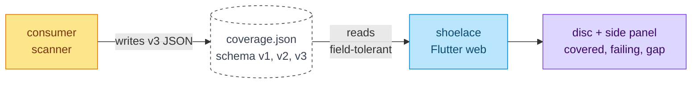
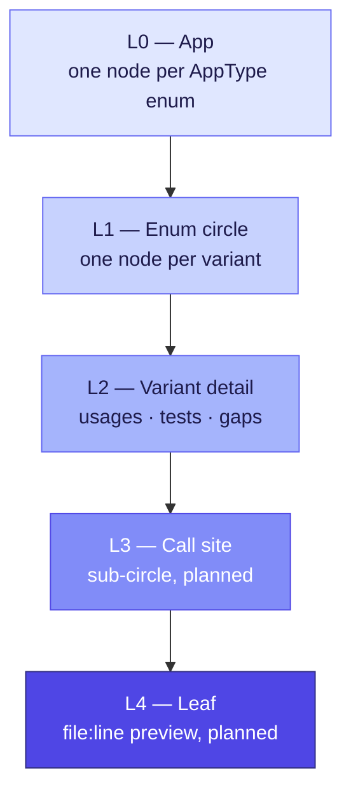
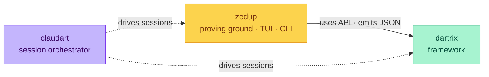

# dartrix

**Enum-driven test matrix framework for Dart. Coverage as geometry.**

dartrix turns your domain enums into a living coverage contract. Every variant declares which features it participates in via an exhaustive switch — adding a new variant without updating the switch is a **compile error**, not a missing test discovered at 2am.

It ships with **shoelace** — a Flutter web visualizer that renders the matrix as a fractal disc. Click a region to drill into per-variant detail: usages, tests, gaps with file:line + class.method context.

> **Deep dive:** [PLAN.md](PLAN.md) is the master roadmap. This README is the entry point.

---

## The matrix in math

dartrix models test coverage as a typed set. Define terms first, then the formula and the picture follow.

| Symbol | Means | Type | Code |
|---|---|---|---|
| `V` | variants — your `AppType` enums (e.g. `Status.draft`) | set of enum values | [`AppType`](lib/src/types/app_type.dart#L27) |
| `F` | features — your `FeatureType` enum (e.g. `dashboard`) | set of enum values | [`FeatureType`](lib/src/types/feature_type.dart#L25) |
| `M` | participation — which `(v, f)` pairs are *required* | `M ⊆ V × F` | per-variant `AppType.features` getter |
| `C(v, f)` | cell function — status of one cell | `→ {covered, gap, notApplicable}` | [`CellState`](lib/src/matrix/matrix.dart#L28) |
| `R(v)` | coverage ratio per variant | `→ [0, 1]` | [`Dartrix.stateOf`](lib/src/matrix/matrix.dart#L75) |
| `Dartrix` | the matrix object itself | class | [`Dartrix`](lib/src/matrix/matrix.dart#L41) |

> `failing` is a fourth `C` state surfaced by the v3 snapshot in shoelace. Core dartrix tracks `covered / gap / notApplicable`.

**Coverage ratio:**

```
        |{ (v, f) ∈ M : C(v, f) = covered }|
R(v) = ───────────────────────────────────────
                |{ (v, f) ∈ M }|
```

**Illustrative slice** — three variants × three features. Read row by row: each variant declares which features it participates in (`M`), each cell carries its state (`C`).

|                    | dashboard  | editor   | export    |
|--------------------|:----------:|:--------:|:---------:|
| `Status.draft`     | covered    | covered  | n/a       |
| `Status.published` | covered    | gap      | covered   |
| `Status.archived`  | failing    | n/a      | gap       |

`R(Status.draft) = 2/2 = 1.0` · `R(Status.published) = 2/3 ≈ 0.67` · `R(Status.archived) = 0/2 = 0.0` (failing counts as not-covered until the test passes; `n/a` cells don't enter `M`).

> **Deep dive:** [Coverage is emphatic](PLAN.md#coverage-is-emphatic) — what makes structural cell coverage different from line coverage.

---

## The problem dartrix solves

You have a `Status` enum:

```dart
enum Status { draft, published, archived }
```

A `dashboard` feature renders each status differently. You write tests for `draft` and `published`, ship, and later add `archived`. Tests still pass. The dashboard silently renders nothing.

dartrix makes that silent gap impossible at compile time.

---

## Compile-time enforcement — minimal end-to-end

<details>
<summary><strong>Click to expand the full example</strong></summary>

**1. Define your features.**

```dart
enum AppFeature implements FeatureType {
  dashboard('Main content dashboard'),
  editor('Rich text editor'),
  export('PDF / CSV export');

  const AppFeature(this.description);
  @override final String description;
}
```

**2. Make domain enums declare participation.**

```dart
enum Status implements AppType {
  draft, published, archived, deleted;

  @override String get description => name;

  @override Set<FeatureType> get features => switch (this) {
    Status.draft     => {AppFeature.dashboard, AppFeature.editor},
    Status.published => {AppFeature.dashboard, AppFeature.export},
    Status.archived  => {AppFeature.dashboard},
    Status.deleted   => {},
  };
}
```

Add `Status.suspended` later without updating the switch → **compile error**. The exhaustive switch IS the contract.

**3. Wire the matrix in your test main.**

```dart
final matrix = Dartrix(axes: [Status.values], features: AppFeature.values);

for (final status in Status.values) {
  if (status.features.contains(AppFeature.dashboard)) {
    testSelector(matrix, status.getSelector(AppFeature.dashboard), (sel) {
      // ... assert dashboard renders status correctly ...
    });
  }
}

tearDownAll(() {
  if (matrix.gaps().isNotEmpty) fail(MatrixRenderer(matrix).renderGaps());
});
```

**4. Read the gap output.**

```
GAPS (3):
  Status.published × editor
  Status.archived  × export
  Status.archived  × editor
```

Specific cells. Not "76% line coverage." Each row is a `(variant, feature)` pair you can fix.

</details>

> **Full walkthrough:** [Proof by example](PLAN.md#proof-by-example) walks a TODO app from compile-time enforcement → gap surfaced → drilldown → test added → coverage closes.

---

## The shoelace visualizer

The Flutter web app under [`shoelace/`](shoelace/) consumes the JSON snapshot any consumer (zedup, your app) emits. It renders the matrix as a fractal disc. Click a region → side panel drills into per-variant detail.



The reader is field-tolerant — v3 fields default to null when reading v2 / v1 payloads. Producers and consumers ship independently.

The hierarchy descends broad → narrow:



Each click drills one level. Levels 0, 3, 4 are planned (Phase 3+). Level 1 + 2 ship today.

> **Deep dive:** [The fractal hierarchy](PLAN.md#the-fractal-hierarchy) maps each level to its marker interface.

---

## Public API

| Type | Role | Code |
|---|---|---|
| `Dartrix` | The matrix. `axes`, `features`, `cover()`, `gaps()`, `stateOf()` | [matrix.dart:41](lib/src/matrix/matrix.dart#L41) |
| `MatrixCell` | `({AppType variant, FeatureType feature})` typedef | [matrix.dart:25](lib/src/matrix/matrix.dart#L25) |
| `CellState` | `covered` · `gap` · `notApplicable` | [matrix.dart:28](lib/src/matrix/matrix.dart#L28) |
| `MatrixRenderer` | `render()` table + `renderGaps()` failure output | [matrix_renderer.dart:24](lib/src/renderer/matrix_renderer.dart#L24) |
| `AppType` | Marker interface for domain enums; declares `features` getter | [app_type.dart:27](lib/src/types/app_type.dart#L27) |
| `FeatureType` | Marker interface for feature axis enums | [feature_type.dart:25](lib/src/types/feature_type.dart#L25) |
| `ComponentType`, `HelperType`, `ClassType` | Markers for Level 3 sub-circle nodes (planned) | [types/](lib/src/types/) |
| `DartrixSelector` | Abstract: `variant`, `feature`, `description` | [selector.dart:33](lib/src/selector/selector.dart#L33) |
| `TypedSelector<V>` | Concrete selector preserving variant subtype | [selector.dart:48](lib/src/selector/selector.dart#L48) |
| `testSelector<S>()` | Wraps `test()`, registers `cover()` after body passes | [test_selector.dart:44](lib/src/selector/test_selector.dart#L44) |
| `ShoelaceLayout`, `ShoelaceNode`, `ShoelaceSegment` | Pure-data shoelace coverage geometry | [shoelace_layout.dart](lib/src/renderer/shoelace_layout.dart) |
| `shoelaceLayoutOf(matrix, variants)` | Builds the layout data | [shoelace_layout.dart:82](lib/src/renderer/shoelace_layout.dart#L82) |

> **Deep dive:** [What's been built](PLAN.md#whats-been-built) tracks each version's additions; [CHANGELOG.md](CHANGELOG.md) is the version-stamped log.

---

## DartrixSelector — typed test selectors

`matrix.cover()` works, but it's manual — easy to forget, easy to call after a failing `expect` (which means it never runs). `DartrixSelector` solves this structurally.

<details>
<summary><strong>Zero-boilerplate path — <code>AppType.getSelector()</code></strong></summary>

Every `AppType` variant produces its own selector via the built-in extension:

```dart
for (final status in Status.values.where((s) => s.isActive)) {
  testSelector(matrix, status.getSelector(AppFeature.dashboard), (sel) {
    expect(sel.variant.label, isNotEmpty);    // sel.variant is Status — typed
  });
}
```

`status.getSelector(AppFeature.dashboard)` returns a `TypedSelector<Status>`. No subclass, no boilerplate.

</details>

<details>
<summary><strong>Concrete subclass path — when you need typed input getters</strong></summary>

```dart
class StatusDashboardSelector implements DartrixSelector {
  const StatusDashboardSelector(this.status);
  final Status status;
  @override AppType get variant      => status;
  @override FeatureType get feature  => AppFeature.dashboard;
  @override String get description   => status.label;
  Widget get widget => DashboardRow(status: status, label: status.label);
}

testSelector(matrix, StatusDashboardSelector(status), (sel) {
  expect(sel.widget.label, equals(sel.status.label));
  // matrix.cover() fires automatically — broken tests never appear covered
});
```

The generic `S` parameter preserves the concrete selector type — body receives `StatusDashboardSelector` directly, no cast.

</details>

### Why selectors over manual `cover()`

| | `matrix.cover()` | `testSelector()` |
|---|---|---|
| Coverage registration | manual, in body | automatic, structural |
| Risk of missing cover | yes — easy to forget | none |
| Risk of cover after failed expect | yes | none |
| Test name | hardcoded string | `selector.description` |
| Concrete type in body | cast required | preserved via `S` |

---

## ShoelaceLayout — coverage as geometry

`MatrixRenderer` prints the matrix as ASCII. `shoelaceLayoutOf` produces the same coverage state as **pure-data geometry** so consumers can render the matrix as a fractal coverage visual: each enum is a circle, variants are nodes around the circumference, a continuous shoelace path laces them together.

<details>
<summary><strong>Code shape</strong></summary>

```dart
final layout = shoelaceLayoutOf(matrix, Status.values);

for (final node in layout.nodes) {
  // node.variant       — Status.draft, Status.published, ...
  // node.angle         — radians, evenly distributed on the unit circle
  // node.coverageRatio — covered participating cells / total, in [0, 1]
}

for (final segment in layout.segments) {
  // segment.fromIndex / segment.toIndex — indices into nodes
  // segment.step                         — position in the lace, 0..N-2
  // segment.isLit                        — true ↔ both endpoints fully covered
}
```

Geometry only. No rendering, no Flutter. Consumers (the Flutter web app under `shoelace/`, future TUI, your renderer) decide how to draw.

</details>

> **Deep dive:** [The mathematics](PLAN.md#the-mathematics) explains the lace path formula, cell function, and disc geometry.

---

## The marker interfaces

Each marker maps to a level in the fractal hierarchy.

| Interface | For | Level | Status |
|---|---|---|---|
| `AppType` | domain enum variants (`Status`, `Role`, …) | L0 / L1 | shipped |
| `FeatureType` | user-facing capabilities (`dashboard`, `editor`) | axis | shipped |
| `ComponentType` | renderable UI units (`header`, `row`, `modal`) | L3 | planned |
| `HelperType` | injectable dependencies (`fetcher`, `formatter`) | L3 | planned |
| `ClassType` | domain models (`Document`, `UserProfile`) | L3 | planned |

> **Deep dive:** [The fractal hierarchy](PLAN.md#the-fractal-hierarchy) maps each marker to its role.

---

## Adopting dartrix

The pattern any project follows. Each step is exhaustive-switch enforced.

1. Declare domain enums as `AppType`.
2. Declare your feature axis as `FeatureType`.
3. Implement `AppType.features` (the participation switch).
4. Wire the matrix in your test main.
5. Use `testSelector()` per variant per feature.
6. Add a `tearDownAll` gap check.

Optional, Phase 3+:

7. Declare domain models as `ClassType`.
8. Declare dependencies as `HelperType`.
9. Declare renderable units as `ComponentType`.

> **Deep dive:** [Templating](PLAN.md#templating--the-pattern-any-project-follows) is the full template with rationale per step.

---

## Multiple axes

The matrix supports multiple domain enums on separate axes — each is crossed against the same feature set:

```dart
final matrix = Dartrix(
  axes: [Status.values, Role.values, ContentType.values],
  features: AppFeature.values,
);
```

Each variant declares its own participation. The matrix unions them all.

---

## Roadmap

<details>
<summary><strong>Six phases — current ship is schema v3 + visual polish</strong></summary>

| Phase | Scope | Status |
|---|---|---|
| 1 | Gap cross-reference (shoelace) | shipped |
| 2 | Test status integration (cross-repo, schema v3) | shipped (consumer side) |
| 3 | `[t]` TUI test screen + template system (zedup-side) | planned |
| 4 | Test runner cache + diff-aware re-runs (zedup-side) | planned |
| 5 | Design subagent (claudart-side) | deferred |
| 6 | Cleanup audit (post-merge, all repos) | planned |

> **Deep dive:** [The 6-phase roadmap](PLAN.md#the-6-phase-roadmap) has scope, deliverables, and exit criteria per phase.

</details>

---

## Cross-repo

Three sibling repos. Each can be used standalone; the integration is composable, not coupled.



Solid edge = active dependency. Dotted = optional orchestration. dartrix runs without zedup or claudart; zedup runs without dartrix's visualizer; claudart runs without either.

---

## Installation

dartrix is not yet on pub.dev. Reference via git:

```yaml
# pubspec.yaml
dev_dependencies:
  dartrix:
    git:
      url: https://github.com/liitx/dartrix.git
```

Requires Dart SDK `>=3.5.0`.

---

## Philosophy

- **Compile-time over runtime.** Exhaustive switches catch gaps before tests run.
- **Participation, not just presence.** A variant that genuinely doesn't participate marks itself `{}` — declared, not skipped.
- **Selectors over manual registration.** The selector carries variant + feature + fixture. Coverage is a consequence, not a chore.
- **Proven before promoted.** Every dartrix API is validated in a real consumer (zedup) before landing here.
- **No magic.** No code generation, no reflection, no annotations. Interfaces, switches, and a map.
- **Schema as boundary contract.** Versioned, additive, field-tolerant. Producers and consumers ship independently.
- **Project-agnostic visualization.** shoelace renders whatever JSON arrives. Variant types and feature names come from the snapshot, not from imports.

---

## Related

- **[zedup](https://github.com/liitx/zedup)** — Zed editor profile manager + TUI dashboard + the first dartrix consumer/producer. Emits the JSON snapshot shoelace reads.
- **[claudart](https://github.com/liitx/claudart)** — Two-agent session orchestrator with typed handoffs and deterministic model routing. Drives `/suggest`, `/debug`, `/save`, `/teardown` slash commands.
- **[shoelace/](shoelace/)** — Flutter web visualizer that consumes the JSON snapshot. See its README for build + serve instructions.
